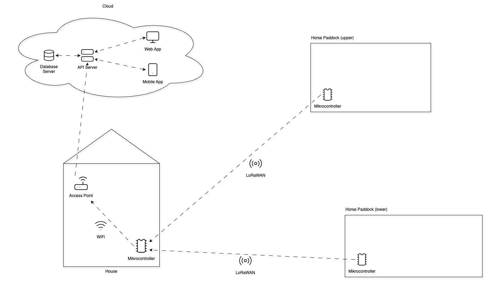
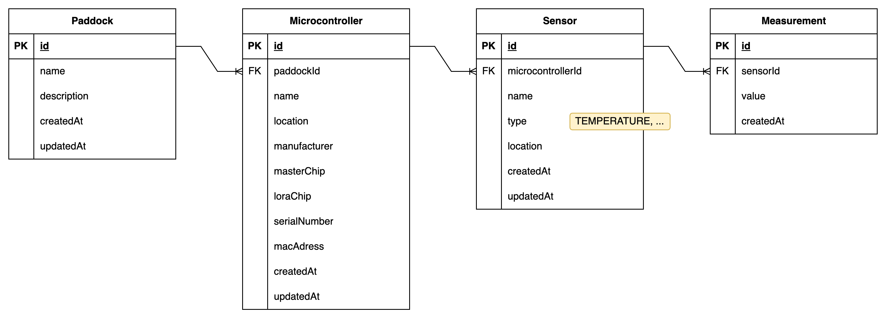

# paddock monitoring

## Projects

### paddock-api
The `paddock-api` is a backend service built with Node.js and Prisma. It provides RESTful API endpoints for managing paddocks, microcontrollers, and sensors. The API interacts with a PostgreSQL database to store and retrieve data.

### paddock-controllers
The `paddock-controllers` is a collection of microcontroller firmware projects that are used to monitor paddocks. The firmware is written in C++ and is designed to run on ESP32 microcontrollers. The firmware reads sensor data and sends it to the `paddock-api`.

### paddock-app
The `paddock-app` is a React Native application that serves as the frontend for the paddock monitoring system. It allows users to view and manage paddocks and their associated microcontrollers and sensors. The app fetches data from the `paddock-api`.